# Capstone Progress

## Progress Report for Sept 6th Deadline
I have begun solidifying my idea to have my mother as the center of my piece. I am aiming to collect stories from her life in her own words as well as expressions of herself in mediums she feels comfortable with. After collecting this data, I will have more clarity on the specific direction of the piece. So far, I have a recording of her singing her favourite gospel song that she describes as being a succinct representation of what her life has looked like over the years. This recording can be found here: [Mom Gospel Song.zip](https://github.com/Alphaam/Capstone/files/9485522/Mom.Gospel.Song.zip)

## Progress Report for Sept 13th Deadline
This week I gave myself two action items. First, I planned to figure out how to actually create an AR piece in the least time-consuming way I could find while not compromising my projects quality. Second, I planned on figuring out how to input my own voice into a project that is very much not about me. 

For the first task, I reached out to Waad, an IM major from the class of 2021, who had a brief element of AR in her IM capstone. From her, I learned of the software, “Artivive.” Artvive allows a user to augment a physical space by simply taking a picture of the space and uploading onto the software the content that the user wishes to have displayed on this physical space when viewed through the Artivive app. I experimented a bit with this and was able to figure out how to do this in a way that felt satisfactory to me. A video of me figuring this out can be found here:

The concerns I have about this technology are the fact that the projected content seems a little wobbly and I would like it to be more stabilized. I plan on experimenting with printing out the target image to be projected on as opposed to using an actual physical object as the subject of projection by the AR technology. This is reported to help with stabilization.

The process of finding my own voice within the piece is on-going, but so far I was able to take a bit of that space by blocking out the content I had collected from my mother and beginning animation based on colours and imagery that appealed to me while still taking into account the ultimate feel of the piece as I know it now. When I engaged in this exercise, I was able to come up with a colour palette that I really love, find brushes that I like, and a poetic interpretation of the story I want to tell that felt true to how I approach understanding a story. A preliminary sketch of the first shot of the animation can be seen here:

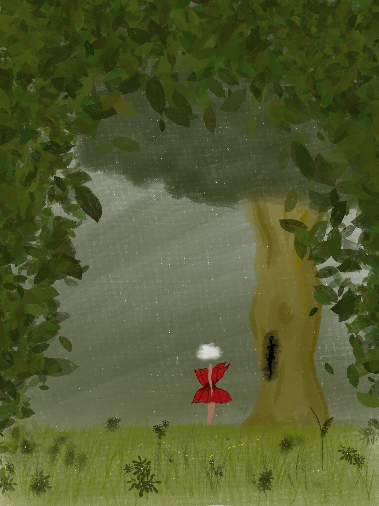

The next steps of my process are figuring out where my project will live. Will it be an installation? Of what scale? Do I want to include light in the piece as a way to further whatever story I will tell? Which one of the many stories that I collected from my mother will be the primary story? 

To answer some of these questions, I am planning on visiting the new exhibit on campus in the gallery space facing the road off campus.

## Progress Report for September 20th(revised)

This week I focused on two things:
1.	Finding inspiration for what the installation space for my project will look like.
2.	Continuing to research AR to find which execution of the technology is best suited for my research.

1. In researching the look of my installation, I visited the exhibit in the art gallery on campus. I went in without any expectations and simply looking for whichever pieces will speak to me aesthetically. I found that I am very, aesthetically, drawn to installations that incorporated ceiling to floor-length flowing textures. Examples of these installations including the one in the art gallery space are as seen below:

 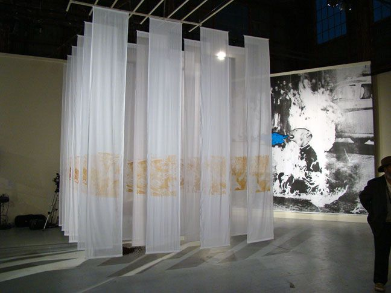
 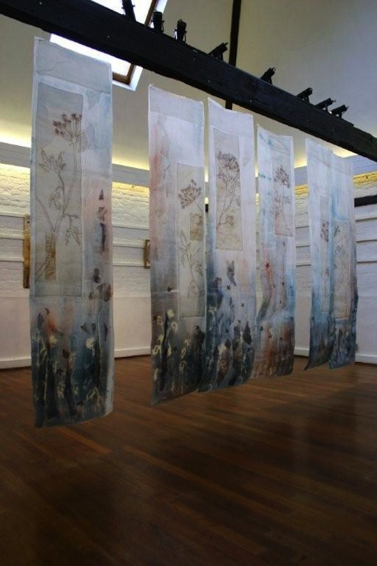
 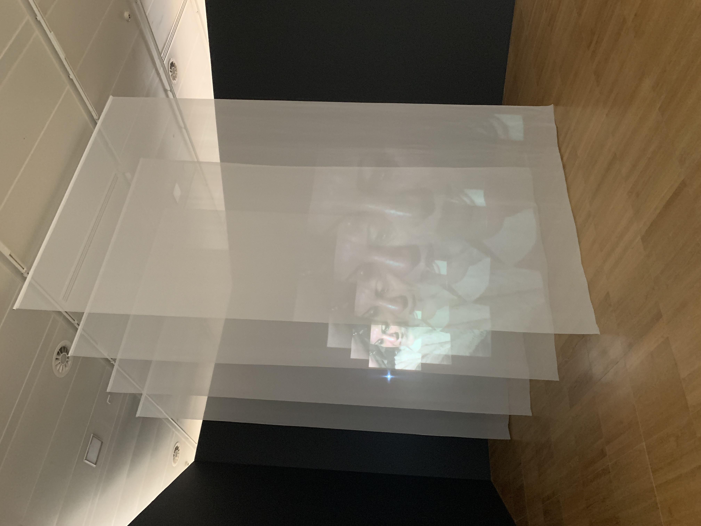
 

I think that this structure of an installation works very well with the kind of animation that I am going to make. Seeing as my animation is going to be a story happening outdoors mainly with an enchanted forest feel, the flowing sheets aid to the aesthetics of the animation quite well. My current idea is having the animation that I make live on these sheets with the story spilling into the sheets next to each other in a way that takes the participant throughout the room following the story on their AR visualization device. I am going to experiment with this structure at a smaller scale in this coming week and see how attainable it is.

Additionally, the flowing sheets made me think of how to potentially represent natural elements within my final installations. I am slowly realizing I want to build a world that a participant can be immersed in and that I want this world to be the forest that my other bases her story abut a lizard in. The flowing sheets can be very useful in developing an outdoors feel when coupled with a fan and sound. With some sound engineering coupled with some fanning, I can make the space feel like it is being affected by the wind and in that way aid in the creation of this forest world.

In the art gallery, I encountered a few pieces that made use of glass/glass-like materials and the illusion of 2D as 3D. I was very drawn to this and I wanted to explore the presentation of 2D content as 3D and it led me to holograms. Some content I was drawn to in my research including during my visit to the installation can be seen below:
  
 
 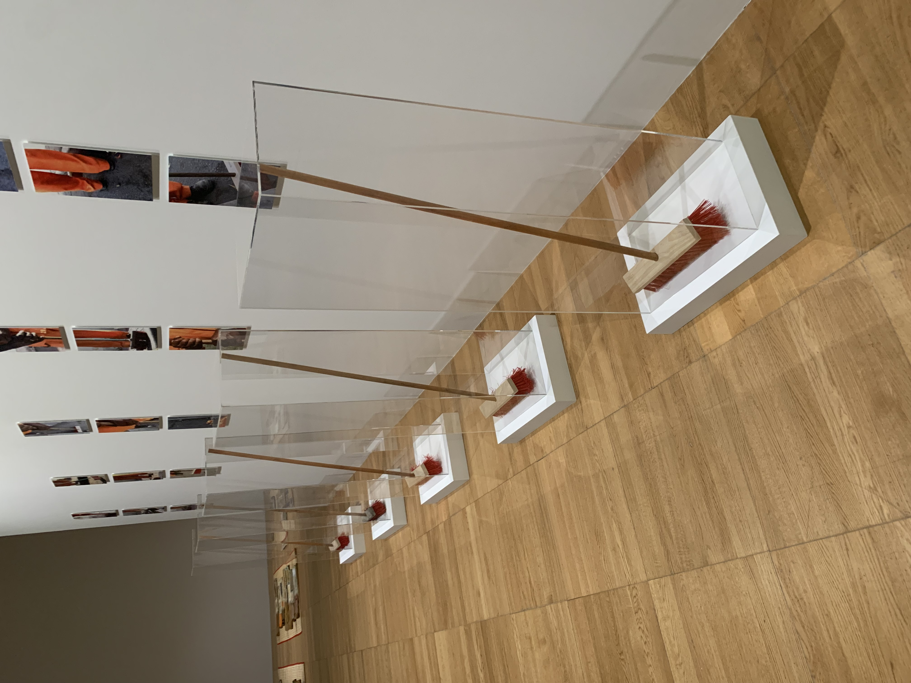
 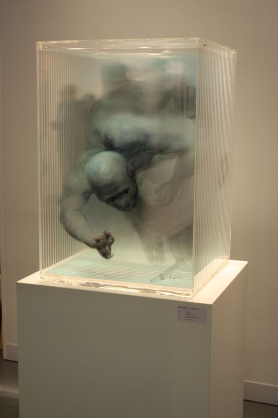
 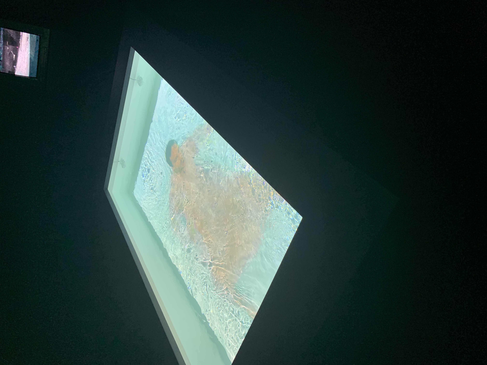
 
 

I imagine that having structures like these looping through certain bits of the animation could aid to the overall aesthetic of the space but I am unsure if it lends itself to the ultimate story of the installation in a way that necessitates them being in the installation. I will continue to sit with this data and see if that changes.

2. I committed some time to learning Unity over the past week. I enrolled into the "Unity: AR Visualization 01 Basic Concepts" course on LinkedIn learning. I begun with the basics of unity and the applications of Unity in relation to AR. The course does seem to have an engineering focus and a 3D design focus. Both of these things are not things that I anticipate will be prominent in my work. Soecifically because I am very drawn to making work in 2D as there is a comfortability in working with 2D that serves me creating this story around my mother feel more approachable. I also think there is something quite poetic about my work in 2D as a opposed to 3D and I want that prominent in my capstone eventually.

My final thoughts about Unity are that it might be a bit too complicated than I will need for this specific project as the primary things I wish to spend time creating are 2D animations and sound. I will continue to spend time learning Unity while I also continue to look at other simpler options before I make a final decision about the software I will use.

This journey with Unity also revealed to me how much I value simplicity in this project. I think I would like the tone of the entire project to communicate simplicity. i am unsure what this actually looks like but I take it as a guiding discovery as I continue to learn about myself and what I want for this project, ultimately.

## Progress Report for September 27th

This week I focused on an element of my project that I am certain will make it into the final version of my capstone: 2D animation. I decided on this primarily because I was feeling overwhelmed by decisions concerning the technology I wanted to use. It felt as though I was being guided by the technology and not what I am actually interested in.

I am relatively new to animation. All I have done so-far animation-wise was from solo exploring and not from any structured learning. Because I am anticipating that this animation will be the longest one I have ever made and one that requires a lot more intention, I decided to start learning some basics.

I decided to first learn about walk-cycles. I notice that I always avoid walk-cycles in the animations that I make because it feels daunting and I can usually get away with it by making my characters fly or float. I know I want my character to walk in this animation and this is an animation tool I want to learn. I, therefore begun watching YouTube videos from creators I feel comfortable with that teach 2D animation. Some of the videos I used include the following:

https://www.youtube.com/watch?v=2y6aVz0Acx0
https://www.youtube.com/watch?v=KDCEvJvAX0w
https://www.youtube.com/watch?v=FYMT1Xj7bTk

In practicing, I begun with creating a walk cycle using a rough sketch of my character and a template I found online. This is what it looked like.

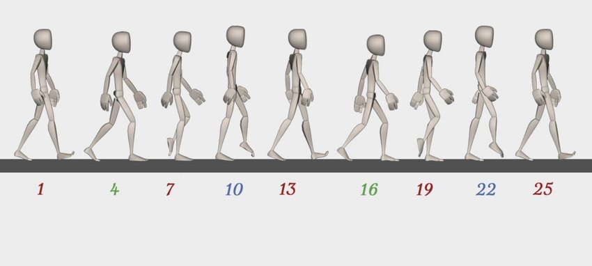
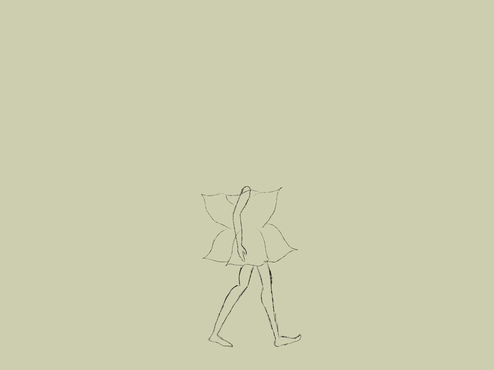

After this, I worked on developing my character a bit more since I only had a rough idea of what she would look like. In developing the character, I first had to research the colour palette I wanted to use. Here, I found that because my story would have a lot to do with nature (trees, lizards, gardens) then the colour palette should have an earth tone overall. However, the story is also about how one develops fear, so the earth-tone would have to be a bit dark. I ended up deciding on the colour palette below:

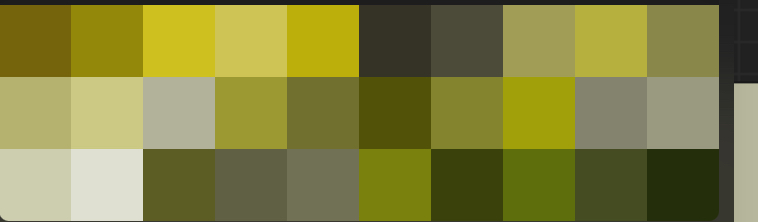

After this, I went ahead and started ideating details of my character. The front and side view of the character can be seen below:

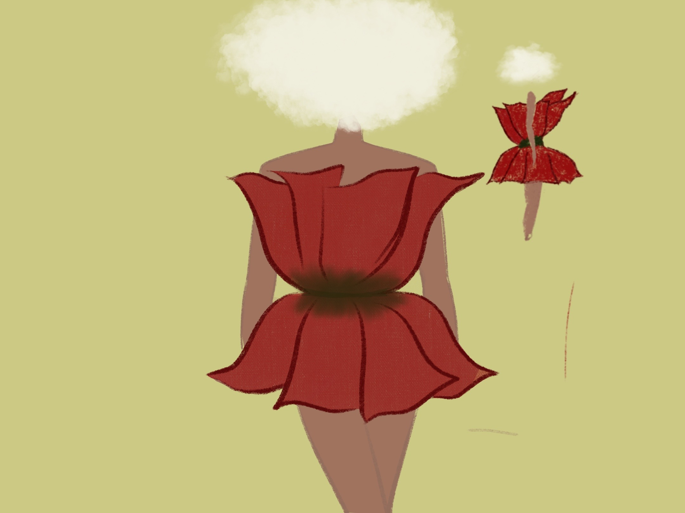

The concept of the character is a play on my mother’s name: Rose. So, the character is a being in a rose-flower dress. It is also a play on the fact that my mother would always hear that her “head is in the clouds” so my character’s head is a cloud.

Although I like the character, I do want to develop it a bit further since I feel as though it might be a little too literal.

After developing my character, I wanted to experiment with the kinematics of this rose dress. I want it to follow the walking motion in a way that is delicate yet intentional. I attempted to do so as seen below:

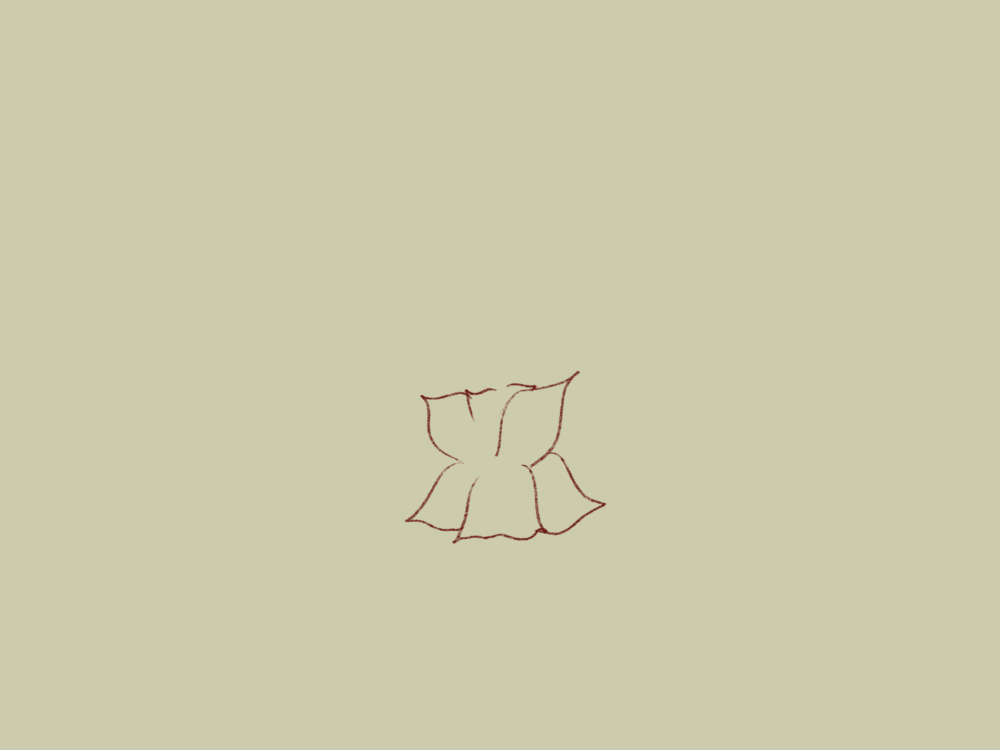
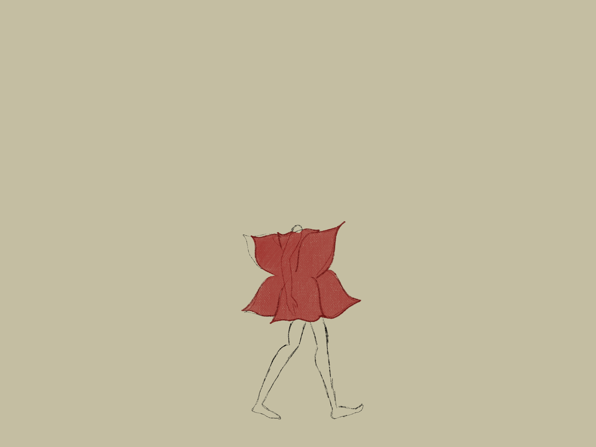

I am not satisfied with this version and I intend on working on it a bit more.

As I worked on this, I started thinking about why I wanted to work with the technologies that I thought I did, namely, AR. I realized I had not thought through the why of the technology outside of the fact that I just was excited by it. I realized that what I was doing with making all these decisions was trying to find a way to make the presentation of 2D animation feel new, immersive and "impressive." I do think that these are valuable however, I do think I want to focus on how to make the story feel immersive more than anything else. For this reason, I do think I want to move away from AR technology because it feels as though it aids more to trying to make the piece feel impressive more than anything else. I do not like the separation that it creates by asking the participant to be on a screen. The alternatives I am exploring are options that can make a 2d experience feel like a 3d experience. The idea I have now id using holographic technology that i will explore further this week and post on my coming blog post. 

## Progress Report for October 11th

This week I focused on continuing to learn about walk cycles. This time with the subject moving towards the screen. For this, I consulted the following tutorials.

https://www.youtube.com/watch?v=0vGDF8sFdAo
https://www.youtube.com/watch?v=68BmVyiIKkI

The first iteration was coming up with a rough sketch of the main character’s walk cycle using the intended proportions of her body. The resulting animation can be seen below.

The second iteration was then adding the rose dress on the character in a way that felt consistent enough in each frame. To do this, I made use of the mid-part of my rough sketch’s torso. This would be where I would, consistently, locate the synch of the rose dress. The resulting draft was one that I felt was consistent enough in dress location. Additionally, I continued to figure out the mechanics of the dress. How would the dress move with the movement of the character’s hips and upper body? I played around with this by also watching videos of people walking in dresses on fashion runways and the output can be seen below.

I am investing so much time in walk cycles because I see my project eventually becoming very dependent on the characters’ movement both to move the plot of the story forward and in aiding the impressiveness of the experience. Because I envision this animation eventually being projected on walls, character movement along the walls would incentivize the participants to
Follow this movement and, ultimately, help them feel more engaged with the space.

When I met with my capstone mentor, we decided that I was also excited to develop more abstract animations. This is because, I think, having more abstract animations for this story would help with making it more metaphoric in a way that also points to the larger themes I am exploring in this capstone. This would also allow me to include the narration of the story, which is very specific, without limiting the take away of the entire piece being the literal story about the lizard. Rather, it would allow for this important story to be told while also allowing for interpretations of the story as informed by abstract animations. In trying to begin thinking more abstractly, I decided to simply create a character taht I imagined while actively fighting back against my impuses towards realism. The output is as seen below.

 
For next week, I will focus my efforts on creating a mood board for my animation as well as creating a storyboard for my animation.

